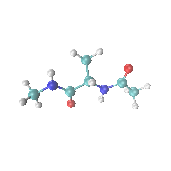
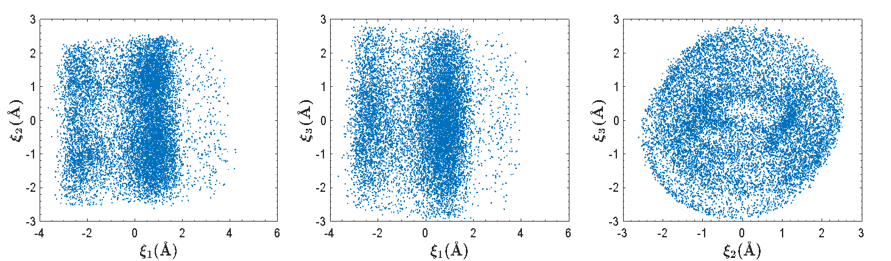
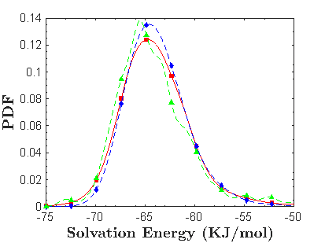

# Initial UQ tools for APBS
The initial tools to perform UQ with APBS have been developed using Matlab. This Matlab code, along with a Python wrapper can be downloaded using the instructions from the following section.

## Download Instructions
You will need to have Python 3.5 or higher interpreter installed in your system. Click [here](https://www.python.org/) to download the one for your system.

To get Matlab and related products follow [this link](https://www.mathworks.com/products/get-matlab.html?s_tid=gn_getml). Once Matlab is installed on your system you will need to install Matlab's engine API for python. You may need admin privileges. To install the engine follow the steps below. More detailed instructions can be found [here](https://www.mathworks.com/help/matlab/matlab_external/install-the-matlab-engine-for-python.html).

* From a command prompt window:

  `$ cd <matlab_root_dir>/extern/engines/python`

  `$ python setup.py install`

## Running the UQ tools for APBS

The tool can be run from a command prompt or any other environment that will allow you to run python and pass command line arguments. To run enter at the command prompt:

`python dsrar.py [-h] --fileName FILENAME --pqrName PQRNAME
                [--polyOrder POLYORDER] [--Nrandomdim NRANDOMDIM]
                [--Npart NPART] [--Nperpart NPERPART] [--startN STARTN]
                [--stopN STOPN] [--stepS STEPS] [--procs PROCS]`

For a description of the flags and options enter:

`python dsrar.py --help`

## Discussion of UQ tools for APBS
The UQ tools are based off of the Data-driven Sparsity-enhancing Rotation for Arbitrary Randomness (DSRAR) framework developed by [[Lei 2019]](https://www.sciencedirect.com/science/article/pii/S0045782519301434). DSRAR does not rely on independence between components of the random inputs and therefore is well-suited for complex systems such as biomolecules where the input distributions can be non-Gaussian or analytically unknown. The basic idea involves a data-driven approach for multivariate orthonormal (or near-orthonormal) basis construction, coupled with a rotation-based sparsity enhancement [[Yang 2016]](https://www.sciencedirect.com/science/article/pii/S0021999115007780). This sparsity-enhancing rotation method has been applied to structural uncertainty in biomolecule systems (i.e., modeling uncertainty represented by the B-factors) [[Lei 2015]](https://epubs.siam.org/doi/abs/10.1137/140981587) as well as parameter uncertainties in solvation energy calculation (e.g., atom radii, charge) [[Yang 2018]](https://pubs.acs.org/doi/abs/10.1021/acs.jctc.7b00905). 

### Overview of DSRAR Framework
The steps below provide a brief overview of the DSRAR procedure. For details and equations, click [[Lei 2019]](https://www.sciencedirect.com/science/article/pii/S0045782519301434).

#### short version
1. Collect atomic trajectory from molecular dynamics (MD) simulation using MD engine of choice. 
2. Perform principal component analysis (PCA) on the trajectory.  A subset of the principal components will become our samples.
3.  Evaluate quantity of interest (solvation energy) on training samples using APBS.
4. Construct data-driven orthonormal basis.  This is based on a generalized polynomial chaos approach.
5. Evaluate the measurement matrix based on the basis computed in Step 4 and solve for the surrogate model coefficients using compressed sensing.
6. Perform sparsity-enhancing rotation method.
7. If the underlying distribution is non-Gaussian and the result from Step 6 does not retain mutual independence, reconstruct the data-driven basis and surrogate model, i.e., repeat Steps 4 and 5. 

#### long version
1. Collect atomic trajectory from molecular dynamics (MD) simulation using MD engine of choice.
2. Using the data collected in Step 1, pre-process trajectory using principal component analysis (PCA). This is the sample set, and a subset of this will be the training set.
The following files are generated:
   - principal components
   - x, y, and z coordinate inputs in compatible format for APBS
3. Using the x, y, and z coordinates computed in Step 2, run APBS to evaluate quantity of interest (solvation energy) on training samples.
The following files are generated:
   - solvation energy of training samples
4. Using the principal components generated in Step 2, create the orthonormal basis for the surrogate model. 
The following files are generated:
   - orthonormal polynomial basis
   - measurement matrix 
5. Using the following to evaluate the measurement matrix and solve for the surrogate model coefficients:
   - trajectory collected in Step 2
   - solvation energy of samples computed in Step 3
   - orthonormal polynomial basis and measurement matrix computed in Step 4
   - the following files are generated:
      - surrogate model
   - Note: We use the [SPGL1](https://www.cs.ubc.ca/~mpf/spgl1/) solver to solve for the model coefficients. 
6. Using the following to calculate the gradient matrix to perform sparsity-enhancing rotation:
   - trajectory collected in Step 2
   - orthonormal polynomial basis computed in Step 4
   - surrogate model computed in Step 5
   - the following files are generated:
      - gradient matrix
      -	rotated training set
7. Repeat Steps 4 - 5 with the rotated training set to reconstruct the orthonormal basis and surrogate model. This step is necessary when the underlying distribution is non-Gaussian.

### Alanine Dipeptide Example
We present a numerical example applying the DSRAR framework for UQ for the solvation energy of a small molecule (alanine dipeptide) with respect to thermally driven conformational fluctuations sampled from an MD simulation. 

Pre-processing random inputs via PCA shows that its underlying distribution is non-Gaussian.  Sampling points representing the joint probability distributions along the first three principal components are shown below.

Following the DSRAR procedure, we constructed the solvation energy surrogate model using APBS-calculated training samples of the solvation energy for different molecular conformations.  Using the constructed surrogate, we can estimate the probability distribution function (PDF) of solvation energies.  

